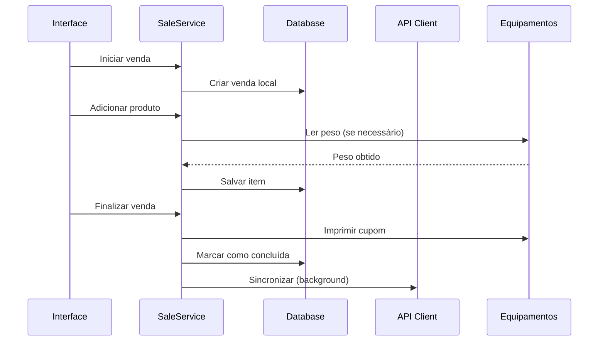
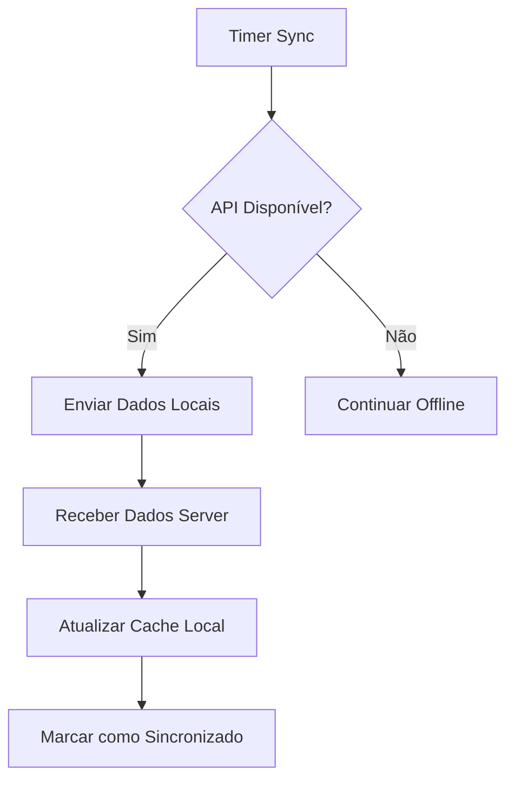

# Arquitetura do App Client Python

Este documento detalha a arquitetura e padrões de desenvolvimento do Cliente Python SRM Gestão.

## 🏗️ Visão Geral da Arquitetura

### Padrões Arquiteturais Adotados

- **Clean Architecture**: Separação clara entre camadas
- **Domain-Driven Design**: Modelagem baseada no domínio de negócio
- **SOLID Principles**: Código maintível e extensível
- **Repository Pattern**: Abstração de acesso a dados
- **Observer Pattern**: Notificação de eventos
- **Factory Pattern**: Criação de objetos equipamentos

### Estrutura de Camadas

```
┌─────────────────────────────────────────┐
│                   UI                    │ ← Interface do Usuário
├─────────────────────────────────────────┤
│                Services                 │ ← Lógica de Negócio
├─────────────────────────────────────────┤
│              Equipment                  │ ← Integração Hardware
├─────────────────────────────────────────┤
│                 Models                  │ ← Modelos de Domínio
├─────────────────────────────────────────┤
│                  API                    │ ← Comunicação Externa
├─────────────────────────────────────────┤
│                 Core                    │ ← Infraestrutura
└─────────────────────────────────────────┘
```

## 📁 Estrutura Detalhada

### `/src/core/` - Infraestrutura

**Responsabilidade**: Funcionalidades básicas e configurações

```python
core/
├── __init__.py          # Exports principais
├── config.py            # Gerenciador de configurações
├── database.py          # Gerenciador SQLite
├── logging.py           # Sistema de logs
└── events.py            # Sistema de eventos (futuro)
```

**Principais Classes**:
- `ConfigManager`: Carregamento e gestão de configurações
- `DatabaseManager`: Abstração do banco SQLite  
- `setup_logging()`: Configuração estruturada de logs

### `/src/models/` - Modelos de Domínio

**Responsabilidade**: Representação de entidades de negócio

```python
models/
├── __init__.py          # Exports dos modelos
├── base.py              # Classe base para todos modelos
├── product.py           # Modelo de Produto
├── customer.py          # Modelo de Cliente
├── sale.py              # Modelos de Venda e Item
├── cashier_session.py   # Modelo de Sessão de Caixa
├── user.py              # Modelo de Usuário
└── company.py           # Modelo de Empresa
```

**Principais Características**:
- Baseados em Pydantic para validação
- Type hints obrigatórios
- Métodos de negócio encapsulados
- Serialização JSON automática

### `/src/api/` - Cliente da API

**Responsabilidade**: Comunicação com backend

```python
api/
├── __init__.py          # Exports da API
├── client.py            # Cliente HTTP base
├── endpoints.py         # Endpoints específicos
└── exceptions.py        # Exceções customizadas
```

**Principais Classes**:
- `APIClient`: Cliente HTTP com retry e autenticação
- `ProductsAPI`, `SalesAPI`: Endpoints específicos
- Exceções tipadas para diferentes erros

### `/src/services/` - Lógica de Negócio

**Responsabilidade**: Orquestração entre camadas

```python
services/
├── __init__.py          # Exports dos services
├── product_service.py   # Lógica de produtos
├── sale_service.py      # Lógica de vendas
├── sync_service.py      # Sincronização offline
└── equipment_service.py # Orquestração de equipamentos
```

**Padrões**:
- Cada service gerencia uma entidade principal
- Coordena entre API, banco local e equipamentos
- Implementa lógica de negócio complexa

### `/src/equipment/` - Hardware

**Responsabilidade**: Integração com equipamentos

```python
equipment/
├── __init__.py          # Exports principais
├── base.py              # Classes base
├── scales/              # Balanças
│   ├── base.py
│   ├── toledo.py
│   ├── filizola.py
│   └── manager.py
├── printers/            # Impressoras
├── fiscal/              # Equipamentos fiscais
└── barcode/             # Leitores código barras
```

**Principais Padrões**:
- Interface comum via classes base
- Factory pattern para diferentes marcas
- Error handling específico
- Logging detalhado de operações

### `/src/ui/` - Interface do Usuário

**Responsabilidade**: Apresentação e interação

```python
ui/
├── __init__.py          # Exports da UI
├── components/          # Componentes reutilizáveis
├── windows/             # Janelas principais
├── dialogs/             # Diálogos e modais
└── themes/              # Temas e estilos
```

### `/src/utils/` - Utilitários

**Responsabilidade**: Funções auxiliares

```python
utils/
├── __init__.py          # Exports dos utils
├── formatters.py        # Formatação de dados
├── validators.py        # Validações brasileiras
└── helpers.py           # Funções auxiliares gerais
```

## 🔄 Fluxo de Dados

### Fluxo de Venda Típico



### Fluxo de Sincronização



## 🏛️ Padrões de Código

### Convenções de Nomenclatura

```python
# Classes: PascalCase
class ProductService:
    pass

# Métodos e variáveis: snake_case
def calculate_total_amount(self):
    unit_price = 10.50

# Constantes: UPPER_SNAKE_CASE
MAX_RETRY_ATTEMPTS = 3

# Arquivos: snake_case.py
# product_service.py
```

### Padrão de Error Handling

```python
try:
    # Operação principal
    result = risky_operation()
    
except SpecificError as e:
    # Log estruturado
    logger.error("Operação falhou", extra={
        'error_type': type(e).__name__,
        'error_details': str(e)
    })
    
    # Reação específica
    handle_specific_error(e)
    
except Exception as e:
    # Fallback genérico
    logger.error("Erro inesperado", exc_info=True)
    raise
```

### Padrão de Logging

```python
# Logger por módulo
logger = logging.getLogger(__name__)

# Contexto estruturado
logger.info("Operação realizada", extra={
    'operation': 'sale_completion',
    'sale_id': 123,
    'amount': 45.60,
    'execution_time': 0.234
})
```

### Padrão de Configuração

```python
# Acesso via manager
config = get_config()
api_url = config.get('api', 'base_url', 'http://localhost:3000')

# Configuração local sobrescreve global
# config/api.json (global)
# config/local_api.json (local/ambiente)
```

## 🧪 Padrões de Teste

### Estrutura de Testes

```
tests/
├── unit/              # Testes unitários
├── integration/       # Testes de integração  
├── equipment/         # Testes de equipamentos
├── fixtures/          # Dados de teste
└── conftest.py        # Configurações pytest
```

### Exemplo de Teste Unitário

```python
class TestProductService:
    @pytest.fixture
    def product_service(self):
        return ProductService(mock_database(), mock_api())
    
    def test_calculate_sale_total(self, product_service):
        # Arrange
        products = [
            Product(price=10.50, quantity=2),
            Product(price=5.25, quantity=1)
        ]
        
        # Act
        total = product_service.calculate_total(products)
        
        # Assert
        assert total == 26.25
```

## 🔧 Extensibilidade

### Adicionando Novos Equipamentos

1. **Criar classe base específica**:
```python
# equipment/new_type/base.py
class BaseNewEquipment(BaseEquipment):
    @abstractmethod
    def specific_operation(self): pass
```

2. **Implementar drivers específicos**:
```python
# equipment/new_type/brand_x.py
class BrandXEquipment(BaseNewEquipment):
    def specific_operation(self):
        # Implementação específica
        pass
```

3. **Criar manager**:
```python
# equipment/new_type/manager.py
class NewEquipmentManager:
    SUPPORTED_BRANDS = {
        'brand_x': BrandXEquipment
    }
```

### Adicionando Nova Funcionalidade

1. **Modelo** (se necessário)
2. **Service** para lógica de negócio
3. **API endpoint** (se houver comunicação)
4. **Componente UI**
5. **Testes**

## 📊 Performance

### Otimizações Implementadas

- **Database**: Índices em colunas críticas
- **API**: Connection pooling e retry inteligente
- **UI**: Lazy loading de dados grandes
- **Equipment**: Timeout apropriado e cache de status

### Monitoramento

```python
# Decorador para medir performance
@measure_time
def expensive_operation():
    pass

# Log estruturado inclui métricas
logger.info("Operation completed", extra={
    'execution_time': 0.234,
    'memory_usage': 45.2
})
```

## 🔒 Segurança

### Princípios Aplicados

- **Input Validation**: Pydantic models
- **SQL Injection**: Prepared statements sempre
- **Logs**: Nunca logar dados sensíveis
- **Configuração**: Separação entre dados públicos e privados

### Exemplo de Validação

```python
class Sale(BaseModel):
    total_amount: Decimal = Field(..., gt=0, description="Valor deve ser positivo")
    customer_document: Optional[str] = Field(None, regex=r'^\d{11}|\d{14}$')
    
    @validator('customer_document')
    def validate_document(cls, v):
        if v and not (validate_cpf(v) or validate_cnpj(v)):
            raise ValueError('Documento inválido')
        return v
```

## 📈 Escalabilidade

### Preparação para Crescimento

- **Modularização**: Cada feature é independente
- **Configuration**: Tudo configurável via arquivos
- **Database**: Schema versionado com migrations
- **API**: Rate limiting e pagination support
- **Logging**: Structured logs para análise

### Pontos de Extensão Futuros

- Plugin system para equipamentos
- Interface web complementar
- Múltiplos bancos de dados
- Integração com ERPs externos
- APIs de terceiros (e-commerce, fiscal)

---

Esta arquitetura garante:
- ✅ **Manutenibilidade**: Código organizado e documentado
- ✅ **Extensibilidade**: Fácil adição de novas funcionalidades  
- ✅ **Testabilidade**: Separação de responsabilidades
- ✅ **Performance**: Otimizações em pontos críticos
- ✅ **Confiabilidade**: Error handling robusto